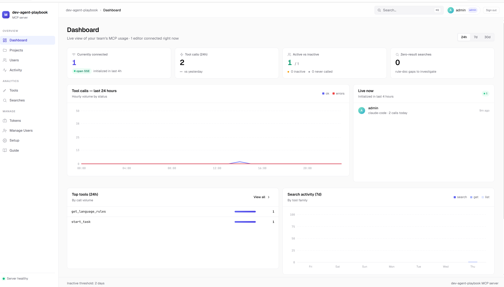
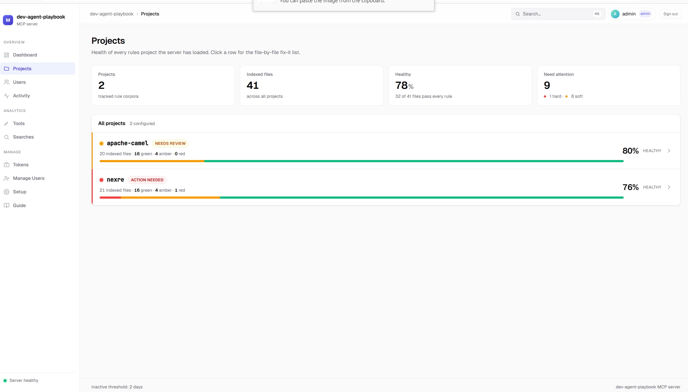
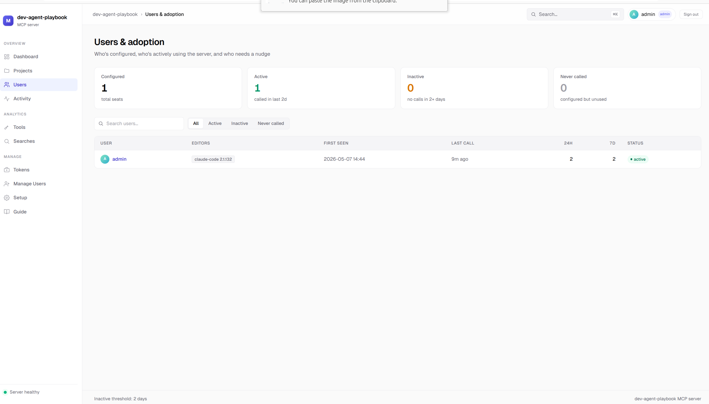
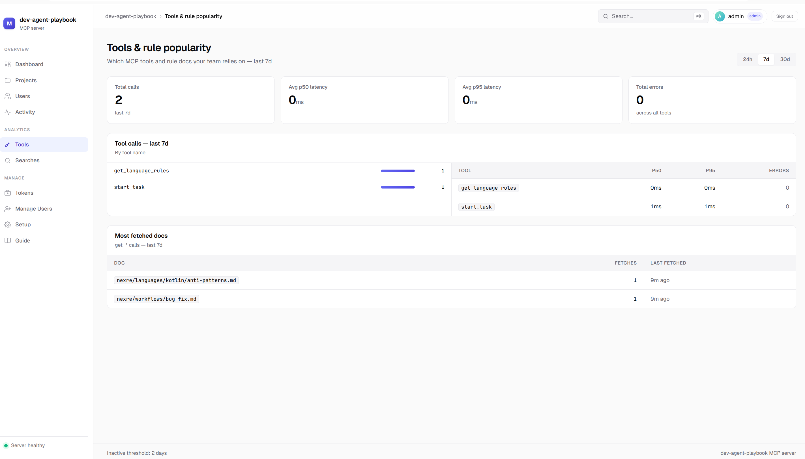
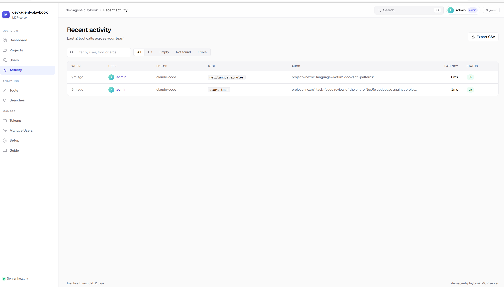
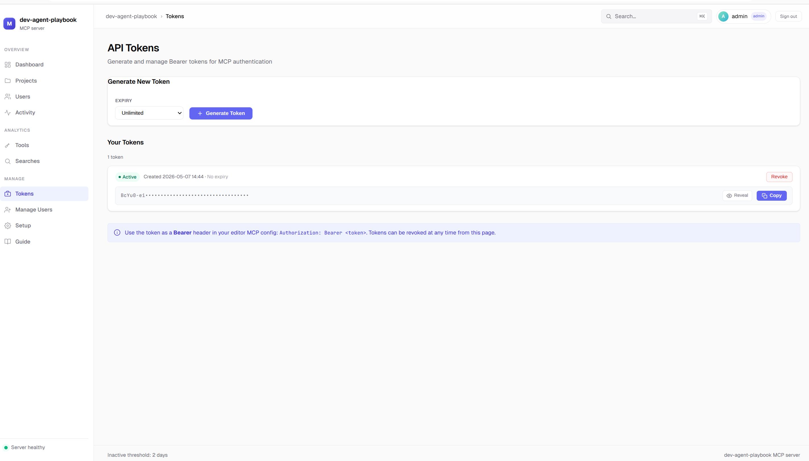
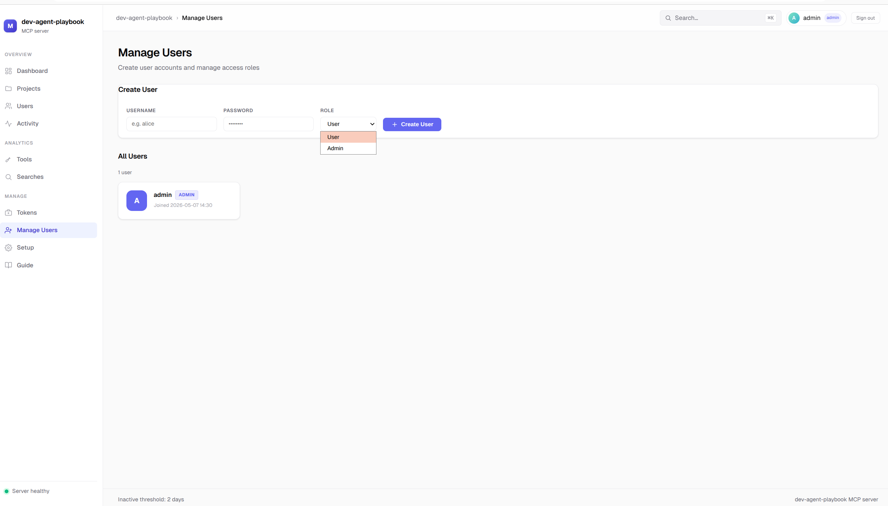

# dev-playbook

## Why this project?

Building apps from scratch is relatively easy with AI tools. The harder problem is **making changes in a large, active codebase** - adding features, fixing bugs, or refactoring across a team where everyone uses a different AI editor.

In an enterprise project, many developers contribute simultaneously, each with their own preferred AI tool: some use Cursor, some use Claude Code, some use Windsurf. The challenge is: how do you produce consistent, high-quality code regardless of which tool a developer is using?

Common solutions like `AGENTS.md` or `DESIGN.md` work, but they require you to dump **all** your project context into a single file upfront - context that isn't relevant to every task, every time. That overhead grows with the project.

**This project solves that with on-demand context delivery over MCP.** Instead of front-loading everything, your rule docs, architecture decisions, error conventions, patterns, and skills live on a central server. Every AI editor - regardless of vendor - connects to it and retrieves only the context relevant to the current task, via BM25 search and structured fetch tools. The server records every tool call so you can see exactly which rules are being used (and which gaps need filling).

<div align="center">
  
  
</div>

---

## Who is this for?

### Rule & skill definers - senior developers and tech managers

You own the standards. Your job is to write and maintain the rule docs that keep AI-generated code consistent across the team. You add new projects, define patterns, document error conventions, and write skills for common tasks. The dashboard shows you which rules are actually being used and where the gaps are.

→ Start with [Adding a project](#adding-a-project)

### Consumers - developers writing code with AI tools

You connect your editor once and then work normally. Instead of copy-pasting context or maintaining local AGENTS.md files, you ask your AI editor a task-focused question and it pulls the right rules automatically. The server handles context retrieval.

→ Start with [Using it in your editor](#using-it-in-your-editor)

---

## Start the server

> This is done once by the team - typically by whoever runs shared infrastructure.

```bash
git clone <this-repo>
cd <repo>/mcp
uv sync
uv run dev.py            # regen INDEX.md → validate → start the server
```

`uv run dev.py` is the recommended dev-loop entry point. It regenerates
each project's `INDEX.md`, runs the validator (`scripts/validate-rules.py
--check`), and only starts the server if validation passes. Add
`--no-serve` to use it as a pre-commit hook, `--no-regen` to mirror CI
exactly, or `--no-check` to skip validation in a pinch.

If you only want to start the server (skipping the regen + validate
steps):

```bash
uv run server.py
```

To bind on all interfaces (LAN / Docker):

```bash
MCP_HOST=0.0.0.0 MCP_PORT=3000 uv run dev.py
```

**Requirements:** Python 3.12+ and [uv](https://docs.astral.sh/uv/getting-started/installation/).

Once started, open the dashboard at **`http://localhost:3000/dashboard/`** - it shows connected editors, call activity, and which rules are being used. Editor connection instructions are in the dashboard under **Setup**.

---

## Adding a project

A **standards** project is a directory under `standards/` that holds HOW-to-build
rule docs for one codebase. A **requirements** project under `requirements/`
holds WHAT-to-build PRDs and stories. The server loads both corpora at startup
(requirements are TTL-reloaded).

### Step 1 - Create the project directory

```
standards/<your-project>/
  README.md                          ← humans
  AGENTS.md                          ← AI entry point (required)
  INDEX.md                           ← auto-generated trigger map (do not hand-edit)
  core/
    guardrails.md                    ← always-on MUST / MUST NOT
    definition-of-done.md            ← tests + lint + security gates
    glossary.md                      ← domain terms
  architecture/
    overview.md                      ← system overview
    decisions/                       ← ADRs, one .md per decision
    diagrams/                        ← optional images
  languages/
    <lang>/                          ← java | typescript | python | kotlin | sql | shell-yaml
      standards.md
      testing.md
      anti-patterns.md
  patterns/
    <name>.md                        ← canonical noun-named patterns
  skills/
    <action>.md                      ← verb-noun playbooks
  workflows/
    new-feature.md
    bug-fix.md
    security-fix.md
    refactor.md
  gates/
    README.md                        ← what each gate enforces
    scripts/
      verify-<lang>.sh               ← executable verification (lint + tests + security)
```

Legacy layout with projects next to `mcp/` is deprecated (2-release shim).
Prefer `standards/` or set `MCP_STANDARDS_ROOT`.

Use `TEMPLATE.md` for copy-pasteable starters and look at `standards/apache-camel/` or
`standards/nexre/` for live examples. Product requirements live under
`requirements/<project>/`.

### Step 2 - Write `AGENTS.md` first

This is the identity doc - what role the AI plays in this project. Keep it
focused: every line should earn its place. Cross-cutting MUST/MUST NOT
rules belong in `core/guardrails.md`, not here.

### Step 3 - Author the always-on docs

| File | What goes in it |
|------|----------------|
| `core/guardrails.md` | Hard MUST / MUST NOT rules. Loaded on every task via `get_guardrails`. |
| `core/definition-of-done.md` | Mechanical (gate scripts) + functional + security checks. |
| `core/glossary.md` | Domain terms so the agent uses your vocabulary. |
| `architecture/overview.md` | Module map, service boundaries, tech stack, external integrations. |

### Step 4 - Languages, patterns, skills, workflows, gates

- `languages/<lang>/standards.md` + `testing.md` + `anti-patterns.md` for each language the project actually uses.
- `patterns/<name>.md` - canonical noun-named patterns ("what good looks like").
- `skills/<action>.md` - verb-noun playbooks. Add `triggers:` and `see_also:` frontmatter so they show up correctly in `INDEX.md`.
- `workflows/{new-feature,bug-fix,security-fix,refactor}.md` - task-driven flows. These are the agent's first stop after `playbook_start_task`.
- `gates/README.md` + `gates/scripts/verify-<lang>.sh` (executable). The validator fails if a gate script is not executable.

### Step 5 - Regenerate `INDEX.md` and validate

```bash
python scripts/validate-rules.py --regen-index
python scripts/validate-rules.py --check
```

`--check` fails if any required file is missing, any doc lands in the
`other` bucket, or `INDEX.md` is stale.

### Step 6 - Restart the server

The server loads files once at startup. After adding or editing docs, restart it so changes are visible:

```bash
cd mcp && uv run server.py
```

### Tips for writing good rules

- **Anti-patterns before patterns** - agents that know what NOT to do make fewer bad choices.
- **Be specific, not general** - "don't use Java DSL" beats "follow best practices."
- **Use your actual vocabulary** - if your team says "connector," write "connector," not "endpoint."
- **Start small** - `agents.md` + one or two patterns is enough to see value. Add more as gaps appear in the dashboard's zero-result searches.
- **Check the dashboard** - the Searches page shows queries that returned no results. Those are your next docs to write.

---

## Using it in your editor

> Connect once. The dashboard **Setup** page has the exact config snippet for your editor (Claude Code, Cursor, Windsurf).

Once connected, type task-focused prompts - the agent fetches the right rules automatically.

### How agents use the server

The MCP surface is designed so an agent can orient itself in **one** call
and chain forward from there. The contract:

| Tool | When to call |
|---|---|
| `playbook_start_task(project, task, requirement?)` | **The entry point - first call for any coding task.** Returns identity + guardrails + optional requirement + matched workflow + `Next Calls`. |
| `playbook_get_doc(kind, project, name?, section?, depth?)` | Fetch any standards or requirement doc. `kind` is one of `agents`, `guardrails`, `architecture`, `language`, `pattern`, `skill`, `workflow`, `gate`, `requirement`. |
| `playbook_search_docs(project, query?, doc_type?, corpus?)` | Discovery. Omit `query` to list every doc with its trigger phrases; pass `query` to search. |
| `playbook_list_requirements(project, …)` | Catalogue PRDs/stories (ids + summaries, never bodies). |
| `playbook_start_requirement(project, intent, …)` | PM authoring bootstrap (template + context + next id). |

`project` is always the basename of the user's workspace directory. All five
tools are read-only and annotated as such (`readOnlyHint`), so clients can
auto-approve them without prompting.

Every doc response ends with a `## Next Calls` block generated from that
doc's `see_also:` / `targets:` frontmatter, naming the exact `playbook_get_doc(...)`
follow-up calls to make. A doc with no `see_also:` is a dead end for the
agent - which is why `AGENTS.md` declares `tool:playbook_start_task`.

### Sample prompts

```
Add a new SFTP inbound route for payments to the apache-camel project.
I need to fix a bug where the orders route is dropping messages.
We have a CVE on Quarkus in apache-camel - patch it.
Refactor the invoice processor without changing behavior.
```

The agent will call `playbook_start_task` first, then chain through the next calls
the bundle returns.

---

## The dashboard

`http://<host>:3000/dashboard/` - open this to monitor usage and manage the server.

<div align="center">
  
  <sub>Dashboard - connected editors, calls today, zero-result rate, hourly activity</sub>
</div>

<br>

- **Dashboard** - live KPIs: connected editors, calls today, zero-result rate, hourly activity.

<div align="center">
  
  <sub>Projects - health score per project, file-by-file validation status, hard vs soft failures</sub>
</div>

<br>

- **Projects** - health of every rules project the server has loaded. Click a row for the file-by-file fix-it list.

<div align="center">
  
  <sub>Users & adoption - who is actively using the server, who has gone quiet, who never connected</sub>
</div>

<br>

- **Users** - who's connected, with `active` / `inactive` / `never-called` status.

<div align="center">
  
  <sub>Tools - call counts and latency per tool, plus which rule docs are fetched most</sub>
</div>

<br>

- **Tools** - call counts, latency, error rate per tool, and which docs are fetched most.

<div align="center">
  
  <sub>Activity - every tool call, the exact args, which editor sent it, and whether it succeeded</sub>
</div>

<br>

- **Searches** - recent queries + a **zero-result list** showing which topics have no docs yet.
- **Activity** - live feed of all tool calls.

<div align="center">
  
  <sub>Tokens - generate per-user Bearer tokens for MCP authentication</sub>
</div>

<div align="center" style="margin-top:16px;">
  
  <sub>Manage Users - create team accounts, assign User or Admin roles</sub>
</div>

<br>

- **Setup** - editor connection instructions for Claude Code, Cursor, and Windsurf.

---

## Environment variables

| Variable | Default | Purpose |
|----------|---------|---------|
| `MCP_HOST` | `127.0.0.1` | Bind address. Use `0.0.0.0` for LAN. |
| `MCP_PORT` | `3000` | HTTP port. |
| `MCP_CONFIG` | `mcp/config.toml` | Override config file path. |
| `MCP_DB_PATH` | `mcp/data/metrics.db` | SQLite file for usage metrics + auth. |
| `MCP_INACTIVE_DAYS` | `2` | Days without a tool call before a user is "inactive". |
| `MCP_SNIPPET_SIZE` | `300` | Search snippet window in chars (clamped 50 - 5000). |
| `MCP_SERVER_LABEL` | `dev-playbook` | Display name shown in the dashboard and MCP registration. |
| `MCP_ADMIN_USER` | `admin` | Default admin username (seeded on first boot). |
| `MCP_ADMIN_PASSWORD` | `admin` | Default admin password. **Required** (non-default) when `MCP_HOST=0.0.0.0`. |
| `MCP_STANDARDS_ROOT` | `<repo>/standards` | Standards corpus root. |
| `MCP_REQUIREMENTS_ROOT` | `<repo>/requirements` | Requirements corpus root. |
| `MCP_REQUIREMENTS_TTL` | `300` | Seconds between requirements corpus reloads. |

## `mcp/config.toml`

```toml
[enable]
# When true, MCP Bearer tokens and dashboard sessions are required.
# Tokens are opaque values stored in the local SQLite auth store
# (pbkdf2-sha256 password hashes) - not Keycloak/OIDC.
auth = false

[admin]
username = "admin"
password = "admin"   # change me; refused when binding 0.0.0.0
```

Auth is entirely local: create users in `/dashboard/users-admin`, issue MCP
tokens in `/dashboard/tokens`, and authenticate editors with
`Authorization: Bearer <token>`.

---

## Troubleshooting

| Symptom | Likely cause | Fix |
|---------|--------------|-----|
| Editor not showing server connected | URL wrong, server not reachable, or auth header missing | `curl <url>/healthz`; check firewall |
| Server exits with "No markdown rule docs loaded" | No project directories with `.md` files under `standards/` | Check that your project folder is under `standards/`, not next to `mcp/` |
| `validate-rules.py --check` reports `INDEX.md is out of date` | Frontmatter changed since INDEX was generated | `python scripts/validate-rules.py --regen-index` and commit the result |
| `validate-rules.py` reports `does not match the expected layout` | A `.md` file landed outside the recognized folders | Move it under one of `core/`, `architecture/`, `languages/<lang>/`, `patterns/`, `skills/`, `workflows/`, `gates/` - or delete it |
| Gate fails with "is not executable" | Script missing the executable bit | `chmod +x gates/scripts/<name>.sh` and commit |
| "Project not found" from a tool | Typo in project name | Ask the agent: *"what projects are available?"* |
| Agent gives outdated rules | Server cached files at startup | Restart the server after editing docs |
| Dashboard shows everyone as `anon@<ip>` | Users haven't set `X-MCP-User` | See the Setup page in the dashboard for the correct config snippet |

---

## Development

```bash
cd mcp
uv sync
uv run pytest                  # unit tests
uv run ruff check .            # lint
uv run ruff format --check .   # format check
```

See [`CONTRIBUTING.md`](CONTRIBUTING.md) for conventions on adding patterns, skills, and rule docs.

## License

Apache License 2.0 - see [`LICENSE`](LICENSE).
